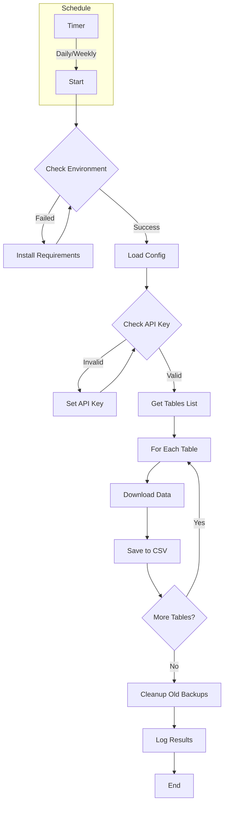

# Airtable Backup Tool


[🇮🇱 לקריאה בעברית](docs/GUIDE_HE.md)

Automated backup solution for Airtable databases. Securely backup your Airtable bases to CSV files with configurable schedules, retention policies, and detailed logging.

## 🚀 Features

- **Automated Backups**: Schedule daily, weekly, or monthly backups
- **Multi-Table Support**: Backup all tables in your Airtable base
- **Data Security**: Secure API key handling and encrypted storage
- **Smart Retention**: Configurable backup retention policy
- **Detailed Logging**: Comprehensive logging with beautiful console output
- **Environment Checks**: Automated environment validation
- **Easy Configuration**: Simple YAML-based configuration

## 📋 Prerequisites

- Python 3.8 or higher
- Airtable API key
- Stable internet connection
- 50MB minimum free space

## ⚡️ Quick Start

```bash
# Clone the repository
git clone https://github.com/moshexx/airtable-backup.git
cd airtable-backup

# Install requirements
pip install -r requirements.txt

# Set your Airtable API key
export AIRTABLE_API_KEY=your_api_key_here  # Linux/Mac
set AIRTABLE_API_KEY=your_api_key_here     # Windows

# Run environment check
python src/check_environment.py

# Start backup
python src/backup.py
```

## 📊 Process Flow



## 📁 Project Structure

```
airtable-backup/
├── src/                     # Source code
│   ├── backup.py           # Main backup code
│   ├── check_environment.py # Environment checker
│   ├── config.py           # Settings
│   └── schedule_backup.py   # Backup scheduler
├── docs/                    # Documentation
│   ├── GUIDE_HE.md         # Hebrew guide
│   └── GUIDE_EN.md         # English guide
├── tests/                   # Tests
├── requirements.txt         # Python requirements
└── .gitignore              # Git ignore rules
```

## ⚙️ Configuration

Basic configuration in `config.py`:

```python
BACKUP_CONFIG = {
    "schedule": {
        "frequency": "daily",     # daily/weekly/monthly
        "time": "23:00",         # HH:MM format
        "retention_days": 30      # Days to keep backups
    },
    "base_id": "your_base_id",
    "backup_dir": "airtable_backups",
    "log_file": "backup.log"
}
```

## 📚 Documentation

- [Full Guide (English)](docs/GUIDE_EN.md)
- [מדריך מלא בעברית](docs/GUIDE_HE.md)
- [Contribution Guidelines](CONTRIBUTING.md)
- [Security Policy](SECURITY.md)
- [Changelog](CHANGELOG.md)

## 🔒 Security

- API keys are stored securely in environment variables
- All sensitive data is handled according to best practices
- See [SECURITY.md](SECURITY.md) for full security policy

## 🤝 Contributing

Contributions are welcome! Please read [CONTRIBUTING.md](CONTRIBUTING.md) for details on our code of conduct and the process for submitting pull requests.

## 📝 License

This project is licensed under the MIT License - see the [LICENSE](LICENSE) file for details.

## 🙋‍♂️ Support

- Create an [Issue](https://github.com/moshexx/airtable-backup/issues)
- Read the [FAQ](docs/FAQ.md)
- Contact: your.email@example.com

## ⭐️ Show Your Support

Give a ⭐️ if this project helped you!

## 📦 Dependencies

- [requests](https://pypi.org/project/requests/) - HTTP library
- [pandas](https://pypi.org/project/pandas/) - Data handling
- [colorama](https://pypi.org/project/colorama/) - Colored terminal output
- [emoji](https://pypi.org/project/emoji/) - Emoji support
- [schedule](https://pypi.org/project/schedule/) - Job scheduling

---
Made with ❤️ by [Your Name]