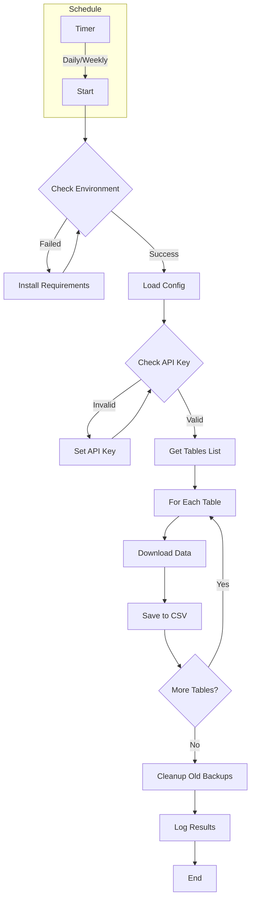

# Airtable Backup Tool Guide

## Table of Contents
- [Overview](#overview)
- [Flow Diagram](#flow-diagram)
- [System Requirements](#system-requirements)
- [Installation](#installation)
- [Configuration](#configuration)
- [Daily Usage](#daily-usage)
- [Troubleshooting](#troubleshooting)
- [Security](#security)
- [FAQ](#faq)

## Overview

This tool provides automated backup functionality for Airtable databases to CSV files. It supports scheduled backups, retention policies, and detailed logging.

### Key Features
- ⚡ Automated backup (daily/weekly/monthly)
- 📊 Support for multiple tables and databases
- 🔐 Secure API key handling
- 📁 Advanced backup retention policy
- 📝 Detailed logging
- 🎨 Beautiful console output
- ⚙️ Simple configuration

## Flow Diagram



## Project Structure

```
airtable-backup/
├── README.md                # Project overview
├── docs/                    # Documentation
│   ├── GUIDE_HE.md         # Hebrew guide
│   └── GUIDE_EN.md         # English guide
├── src/                     # Source code
│   ├── backup.py           # Main backup code
│   ├── check_environment.py # Environment checker
│   ├── config.py           # Settings
│   └── schedule_backup.py   # Backup scheduler
├── requirements.txt         # Python requirements
└── .gitignore              # Git ignore rules
```

## System Requirements

### Minimum Requirements
- Python 3.8 or higher
- Stable internet connection
- 50MB minimum free space
- Write permissions in working directory
- Airtable API key

### Required Python Packages
- requests
- pandas
- colorama
- emoji
- schedule

## Installation

### Step 1: Install Python
1. Download Python from official website:
   - Windows: [python.org/downloads](https://www.python.org/downloads/)
   - Linux: `sudo apt-get install python3`
   - Mac: `brew install python3`

2. Verify installation:
```bash
python --version
```

### Step 2: Download Project
```bash
git clone https://github.com/moshexx/airtable-backup.git
cd airtable-backup
```

### Step 3: Install Requirements
```bash
pip install -r requirements.txt
```

### Step 4: Set API Key
```bash
# Windows
set AIRTABLE_API_KEY=your_api_key_here

# Linux/Mac
export AIRTABLE_API_KEY=your_api_key_here
```

## Configuration

### Basic Settings (config.py)
```python
BACKUP_CONFIG = {
    "schedule": {
        "frequency": "daily",     # daily/weekly/monthly
        "time": "23:00",         # HH:MM format
        "retention_days": 30      # Days to keep backups
    },
    "base_id": "your_base_id",
    "backup_dir": "airtable_backups",
    "log_file": "backup.log"
}
```

### Advanced Settings
- Backup frequency
- Backup location
- Retention policy
- Log settings

## Daily Usage

### Run Single Backup
```bash
python src/backup.py
```

### Start Scheduled Backup
```bash
python src/schedule_backup.py
```

### Check Environment
```bash
python src/check_environment.py
```

## Troubleshooting

### Common Issues and Solutions

#### 1. Python Not Installed Properly
Issue: `'python' is not recognized as an internal or external command`
Solution:
- Verify Python installation
- Check PATH environment variable
- Reinstall with "Add to PATH" option

#### 2. Permission Issues
Issue: `Permission denied`
Solution:
- Run with admin privileges
- Check backup directory permissions
- Verify write permissions

#### 3. API Issues
Issue: `401 Unauthorized`
Solution:
- Check API key
- Verify environment variable setting
- Check Airtable permissions

## Security

### Security Recommendations
1. Secure API key storage
2. Limit backup file access
3. Use encryption for sensitive files
4. Regular password updates
5. Set retention policies

### Recommended Configuration
- Set read-only API permissions
- Use environment variables
- Restrict backup directory access

## FAQ

### General
Q: How long does a backup take?
A: Depends on database size, typically 1-5 minutes.

Q: Does backup affect performance?
A: No, the backup process is efficient and doesn't impact system performance.

### Technical
Q: How to update backup frequency?
A: Update the `frequency` parameter in `config.py`.

Q: Where are backups stored?
A: In the `airtable_backups` directory by default, configurable in settings.

## Support and Help

### Useful Links
- [Source Code](https://github.com/moshexx/airtable-backup)
- [Bug Reports](https://github.com/moshexx/airtable-backup/issues)
- [Airtable API Documentation](https://airtable.com/developers/web/api/introduction)

### Contact
If you encounter an undocumented issue, please create a [new issue](https://github.com/moshexx/airtable-backup/issues/new) on GitHub.
# Airtable Backup Tool Guide

## Table of Contents
- [Overview](#overview)
- [Flow Diagram](#flow-diagram)
- [System Requirements](#system-requirements)
- [Installation](#installation)
- [Configuration](#configuration)
- [Daily Usage](#daily-usage)
- [Troubleshooting](#troubleshooting)
- [Security](#security)
- [FAQ](#faq)

## Overview

This tool provides automated backup functionality for Airtable databases to CSV files. It supports scheduled backups, retention policies, and detailed logging.

### Key Features
- ⚡ Automated backup (daily/weekly/monthly)
- 📊 Support for multiple tables and databases
- 🔐 Secure API key handling
- 📁 Advanced backup retention policy
- 📝 Detailed logging
- 🎨 Beautiful console output
- ⚙️ Simple configuration

## Flow Diagram


## Project Structure

```
airtable-backup/
├── README.md                # Project overview
├── docs/                    # Documentation
│   ├── GUIDE_HE.md         # Hebrew guide
│   └── GUIDE_EN.md         # English guide
├── src/                     # Source code
│   ├── backup.py           # Main backup code
│   ├── check_environment.py # Environment checker
│   ├── config.py           # Settings
│   └── schedule_backup.py   # Backup scheduler
├── requirements.txt         # Python requirements
└── .gitignore              # Git ignore rules
```

## System Requirements

### Minimum Requirements
- Python 3.8 or higher
- Stable internet connection
- 50MB minimum free space
- Write permissions in working directory
- Airtable API key

### Required Python Packages
- requests
- pandas
- colorama
- emoji
- schedule

## Installation

### Step 1: Install Python
1. Download Python from official website:
   - Windows: [python.org/downloads](https://www.python.org/downloads/)
   - Linux: `sudo apt-get install python3`
   - Mac: `brew install python3`

2. Verify installation:
```bash
python --version
```

### Step 2: Download Project
```bash
git clone https://github.com/moshexx/airtable-backup.git
cd airtable-backup
```

### Step 3: Install Requirements
```bash
pip install -r requirements.txt
```

### Step 4: Set API Key
```bash
# Windows
set AIRTABLE_API_KEY=your_api_key_here

# Linux/Mac
export AIRTABLE_API_KEY=your_api_key_here
```

## Configuration

### Basic Settings (config.py)
```python
BACKUP_CONFIG = {
    "schedule": {
        "frequency": "daily",     # daily/weekly/monthly
        "time": "23:00",         # HH:MM format
        "retention_days": 30      # Days to keep backups
    },
    "base_id": "your_base_id",
    "backup_dir": "airtable_backups",
    "log_file": "backup.log"
}
```

### Advanced Settings
- Backup frequency
- Backup location
- Retention policy
- Log settings

## Daily Usage

### Run Single Backup
```bash
python src/backup.py
```

### Start Scheduled Backup
```bash
python src/schedule_backup.py
```

### Check Environment
```bash
python src/check_environment.py
```

## Troubleshooting

### Common Issues and Solutions

#### 1. Python Not Installed Properly
Issue: `'python' is not recognized as an internal or external command`
Solution:
- Verify Python installation
- Check PATH environment variable
- Reinstall with "Add to PATH" option

#### 2. Permission Issues
Issue: `Permission denied`
Solution:
- Run with admin privileges
- Check backup directory permissions
- Verify write permissions

#### 3. API Issues
Issue: `401 Unauthorized`
Solution:
- Check API key
- Verify environment variable setting
- Check Airtable permissions

## Security

### Security Recommendations
1. Secure API key storage
2. Limit backup file access
3. Use encryption for sensitive files
4. Regular password updates
5. Set retention policies

### Recommended Configuration
- Set read-only API permissions
- Use environment variables
- Restrict backup directory access

## FAQ

### General
Q: How long does a backup take?
A: Depends on database size, typically 1-5 minutes.

Q: Does backup affect performance?
A: No, the backup process is efficient and doesn't impact system performance.

### Technical
Q: How to update backup frequency?
A: Update the `frequency` parameter in `config.py`.

Q: Where are backups stored?
A: In the `airtable_backups` directory by default, configurable in settings.

## Support and Help

### Useful Links
- [Source Code](https://github.com/moshexx/airtable-backup)
- [Bug Reports](https://github.com/moshexx/airtable-backup/issues)
- [Airtable API Documentation](https://airtable.com/developers/web/api/introduction)

### Contact
If you encounter an undocumented issue, please create a [new issue](https://github.com/moshexx/airtable-backup/issues/new) on GitHub.
