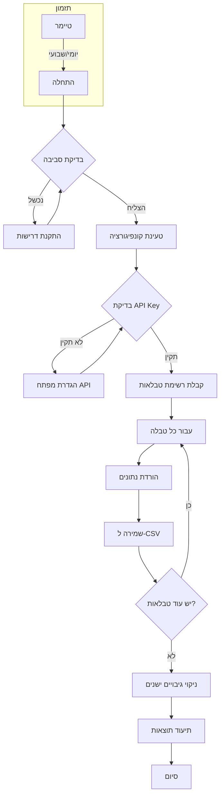

<div dir="rtl">

# כלי גיבוי ל-Airtable

## תוכן עניינים
- [סקירה כללית](#סקירה-כללית)
- [תרשים זרימה](#תרשים-זרימה)
- [דרישות מערכת](#דרישות-מערכת)
- [התקנה](#התקנה)
- [קונפיגורציה](#קונפיגורציה)
- [שימוש שוטף](#שימוש-שוטף)
- [פתרון בעיות](#פתרון-בעיות)
- [אבטחה](#אבטחה)
- [שאלות נפוצות](#שאלות-נפוצות)

## סקירה כללית

כלי זה מאפשר גיבוי אוטומטי של בסיסי נתונים מ-Airtable לקבצי CSV. הכלי תומך בגיבוי מתוזמן, מדיניות שמירת גיבויים, ותיעוד מפורט.

### תכונות עיקריות
- ⚡ גיבוי אוטומטי (יומי/שבועי/חודשי)
- 📊 תמיכה במספר טבלאות ובסיסי נתונים
- 🔐 טיפול מאובטח במפתחות API
- 📁 מדיניות שמירת גיבויים מתקדמת
- 📝 תיעוד מפורט
- 🎨 פלט קונסולה מעוצב
- ⚙️ קונפיגורציה פשוטה

## תרשים זרימה

תרשים זה מציג את תהליך הגיבוי המלא:



## מבנה הפרויקט

```
airtable-backup/
├── README.md                # תיאור כללי של הפרויקט
├── docs/                    # תיעוד
│   ├── GUIDE_HE.md         # מדריך בעברית
│   └── GUIDE_EN.md         # מדריך באנגלית
├── src/                     # קוד מקור
│   ├── backup.py           # קוד הגיבוי הראשי
│   ├── check_environment.py # בדיקת סביבת העבודה
│   ├── config.py           # הגדרות
│   └── schedule_backup.py   # תזמון גיבויים
├── requirements.txt         # דרישות Python
└── .gitignore              # קבצים להתעלמות
```

## דרישות מערכת

### דרישות מינימליות
- Python 3.8 ומעלה
- חיבור אינטרנט יציב
- 50MB שטח פנוי מינימלי
- הרשאות כתיבה בתיקיית העבודה
- מפתח API של Airtable

### חבילות Python נדרשות
- requests
- pandas
- colorama
- emoji
- schedule

## התקנה

### שלב 1: התקנת Python
1. הורד את Python מהאתר הרשמי:
   - Windows: [python.org/downloads](https://www.python.org/downloads/)
   - Linux: `sudo apt-get install python3`
   - Mac: `brew install python3`

2. וודא התקנה תקינה:
```bash
python --version
```

### שלב 2: הורדת הפרויקט
```bash
git clone https://github.com/moshexx/airtable-backup.git
cd airtable-backup
```

### שלב 3: התקנת דרישות
```bash
pip install -r requirements.txt
```

### שלב 4: הגדרת מפתח API
```bash
# Windows
set AIRTABLE_API_KEY=your_api_key_here

# Linux/Mac
export AIRTABLE_API_KEY=your_api_key_here
```

## קונפיגורציה

### הגדרות בסיסיות (config.py)
```python
BACKUP_CONFIG = {
    "schedule": {
        "frequency": "daily",     # daily/weekly/monthly
        "time": "23:00",         # HH:MM
        "retention_days": 30      # ימי שמירת גיבויים
    },
    "base_id": "your_base_id",
    "backup_dir": "airtable_backups",
    "log_file": "backup.log"
}
```

### הגדרות מתקדמות
- תדירות גיבוי
- מיקום קבצי גיבוי
- מדיניות שמירת גיבויים
- הגדרות לוג

## שימוש שוטף

### הפעלת גיבוי חד פעמי
```bash
python src/backup.py
```

### הפעלת גיבוי מתוזמן
```bash
python src/schedule_backup.py
```

### בדיקת סביבת עבודה
```bash
python src/check_environment.py
```

## פתרון בעיות

### בעיות נפוצות ופתרונן

#### 1. Python לא מותקן כראוי
בעיה: `'python' is not recognized as an internal or external command`
פתרון: 
- וודא שPython מותקן
- וודא שPython נמצא בPATH
- נסה להתקין מחדש עם האופציה "Add to PATH"

#### 2. בעיות הרשאות
בעיה: `Permission denied`
פתרון:
- הרץ עם הרשאות מנהל
- בדוק הרשאות בתיקיית הגיבוי
- וודא הרשאות כתיבה

#### 3. בעיות API
בעיה: `401 Unauthorized`
פתרון:
- בדוק את מפתח הAPI
- וודא שהמפתח הוגדר נכון במשתני הסביבה
- בדוק הרשאות בAirtable

## אבטחה

### המלצות אבטחה
1. שמור על מפתח הAPI בצורה מאובטחת
2. הגבל גישה לקבצי הגיבוי
3. השתמש בהצפנה לקבצים רגישים
4. עדכן סיסמאות באופן קבוע
5. הגדר מדיניות שמירת גיבויים

### תצורה מומלצת
- הגדר הרשאות קריאה בלבד לAPI
- השתמש במשתני סביבה
- הגבל גישה לתיקיית הגיבויים

## שאלות נפוצות

### כללי
ש: כמה זמן לוקח גיבוי?
ת: תלוי בגודל הבסיס, בדרך כלל בין דקה לחמש דקות.

ש: האם הגיבוי משפיע על הביצועים?
ת: לא, הגיבוי מתבצע בצורה יעילה ולא משפיע על ביצועי המערכת.

### טכני
ש: איך מעדכנים את תדירות הגיבוי?
ת: עדכן את הפרמטר `frequency` בקובץ `config.py`.

ש: איפה נשמרים הגיבויים?
ת: בתיקיית `airtable_backups` כברירת מחדל, ניתן לשנות בקונפיגורציה.

## תמיכה ועזרה

### קישורים שימושיים
- [קוד המקור](https://github.com/moshexx/airtable-backup)
- [דיווח על באגים](https://github.com/moshexx/airtable-backup/issues)
- [תיעוד Airtable API](https://airtable.com/developers/web/api/introduction)

### יצירת קשר
אם נתקלת בבעיה שלא מתועדת כאן, אנא צור [issue חדש](https://github.com/moshexx/airtable-backup/issues/new) בגיטהאב.

</div>